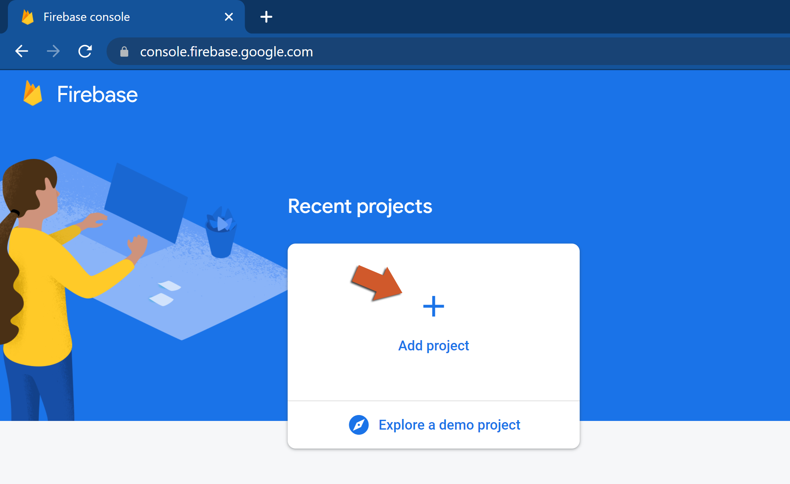
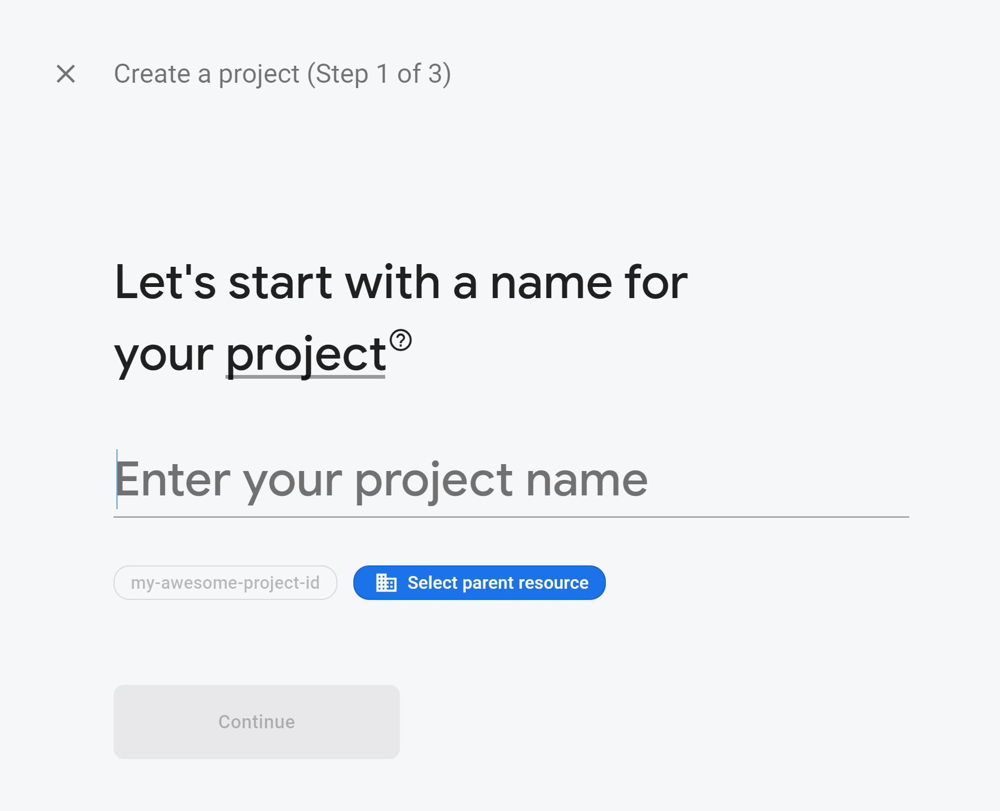
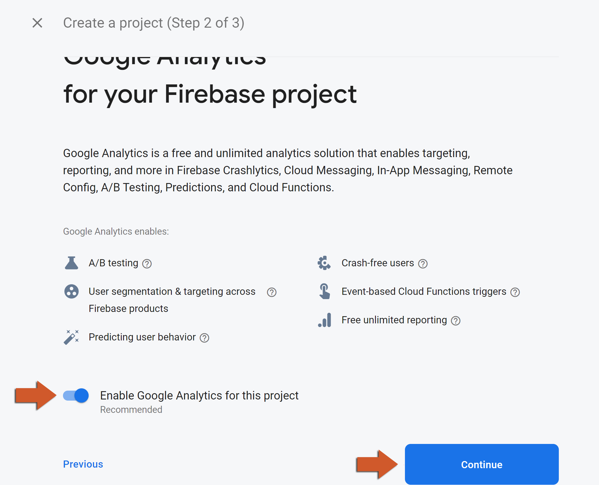
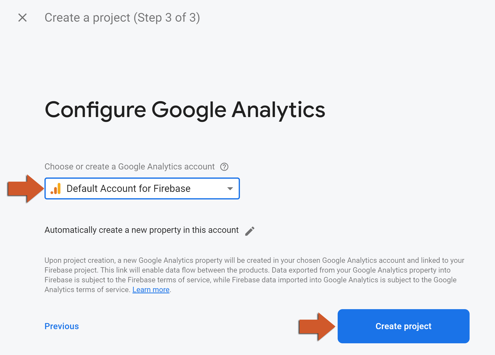
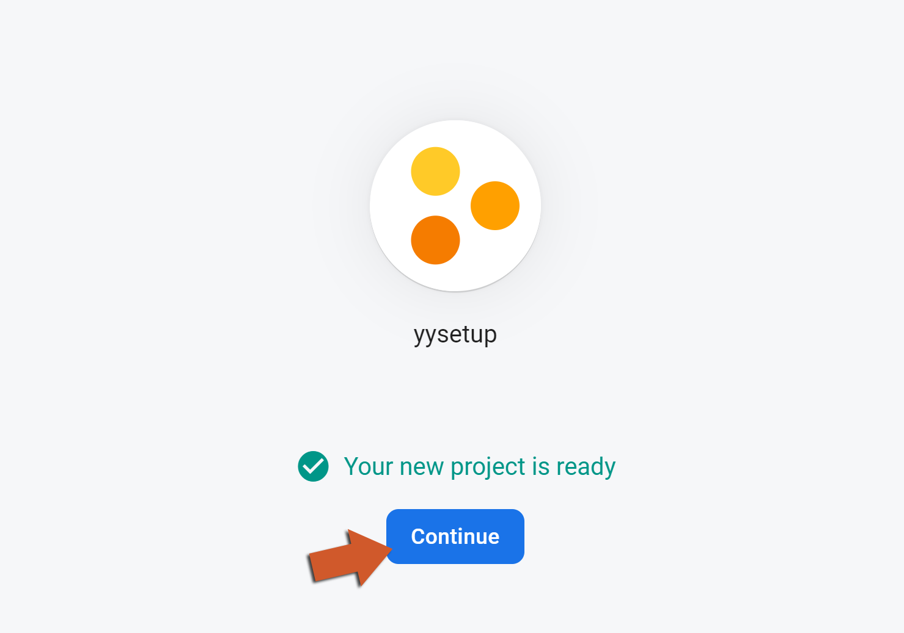

@title Analytics Guides

<!-- Page HTML do not touch -->
<a />
[Back To Top](#top)

# Create Project

  Before working with any Firebase functions, you must set up your Firebase project:

1. Go to the [Firebase Console](https://console.firebase.google.com/) web site.
2. Click on **Add Project** to create your new project. 
      

3. Enter a name for your project and click on the **Continue** button. 
      

4. On the next page, make sure that **Enable Google Analytics for this project** is enabled and then click the **Continue** button: 
      

5. Select your account and click the **Create project** button: 
      

6. Wait a moment until you project is created; after a few moments you should see the page shown below: 
      

7. You will now be taken to your new project's home page: 
      

8. Continue your adventure with the Firebase extensions provided for GameMaker!

  

---

<!-- Page HTML do not touch -->
<a />
[Back To Top](#top)

# Platform Setup

Firebase Analytics implementation uses SDK dependencies and therefore is only available on the **Android**, **iOS** and **Web** targets. In this section we will cover the required setup necessary to start using the Analytics extension on your game.
Select your target platform below and follow the simple steps to get your project up and running (you only need follow this topics once per project):

* ${page.Platform_Setup#Android_Setup}
* ${page.Platform_Setup#iOS_Setup}
* ${page.Platform_Setup#Web_Setup}

  

---