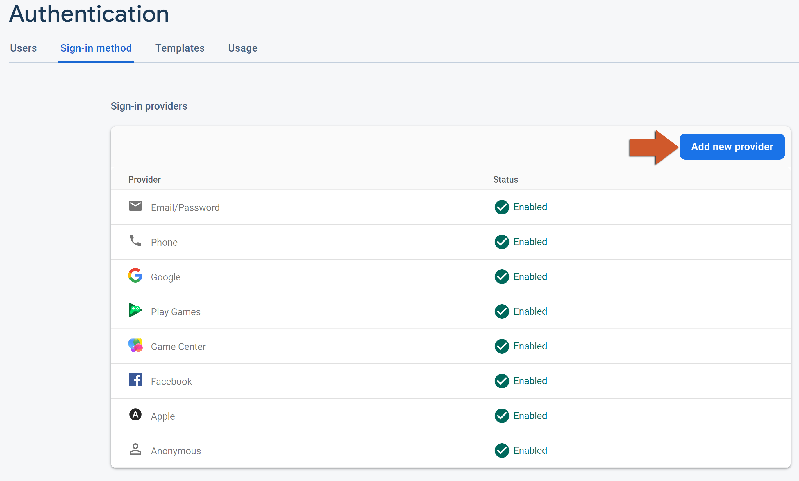
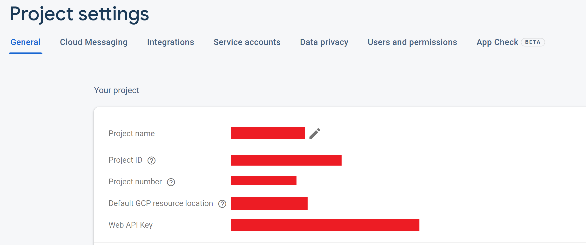
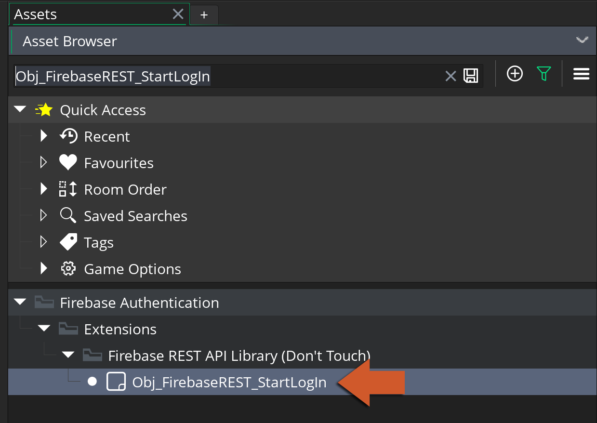

@title Authentication Guides

<!-- Page HTML do not touch -->
<a />
[Back To Top](#top)

# Firebase Console

  Before we are able to use the Firebase Authentication extension, we need to enable it within the [Firebase Console](https://console.firebase.google.com/).

1. On your Firebase project, click on **Authentication** and then the **Get Started** button. 
          

2. Go to the **Sign-in method** tab and choose the providers that you want to use (in the image below you can see the providers compatible with GameMaker at the moment) 
      

3. You've now finished configuring the Firebase Console for using the Firebase Authentication extension.

  

---

<!-- Page HTML do not touch -->
<a />
[Back To Top](#top)

# Platform Setup

  Firebase Authentication implementation uses both SDK (working on **Android**, **iOS** and **Web** ) and REST API that allows it to work on other platforms. In this section we will cover the required setup necessary to start using the Firebase Authentication extension on your game.
  Select your target platform below and follow the simple steps to get your project up and running:

* ${page.Platform_Setup#Android_Setup} (once per project)
* ${page.Platform_Setup#iOS_Setup} (once per project)
* ${page.Platform_Setup#Web_Setup} (once per project)
* ${page.Platform_Setup#REST_API_Setup}

## Advanced Configuration

  Firebase Authentication by default uses SDKs on **Android**, **iOS** and **Web** targets and uses REST API for all other exports but you can change this behavior (i.e.: forcing REST API to be used even on SDK versioned platforms) by changing the options on the extension window (2). 
    

  

---

<!-- Page HTML do not touch -->
<a />
[Back To Top](#top)

# REST API Setup

  This setup is necessary for syncing the Firebase Authentication console with the REST API implementation.

1. On your Firebase console, click on the **Settings** icon (next to **Project Overview**) and then on Project settings: 
        

2. Now copy your **Web API Key** (shown at the bottom): 
          

3. In your GameMaker project, open the extension **YYFirebaseAuthentication** . 
      

4. You should now past your **WebAPI Key**  **in the correct field on the extension options at the bottom of the window. Also make sure you enable the Only_REST_API** mode to make sure it will work on the available exports.

5. Add an instance of **Obj_FirebaseREST_StartLogIn**  in your very first room. 
      

6. Now you have Firebase Authentication on all your REST API exports!

  

---