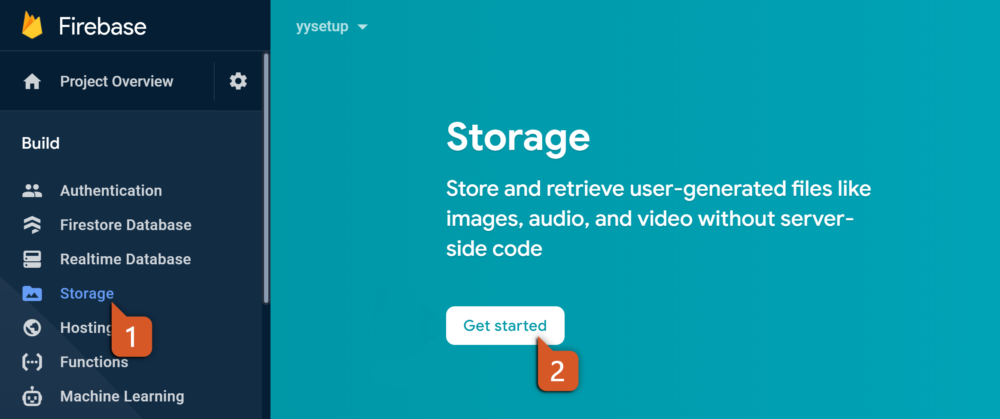
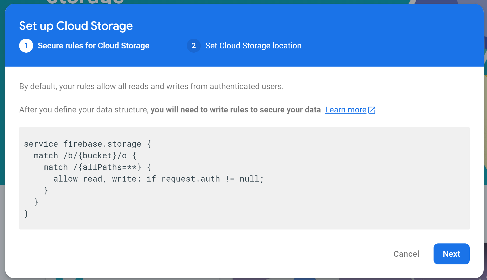
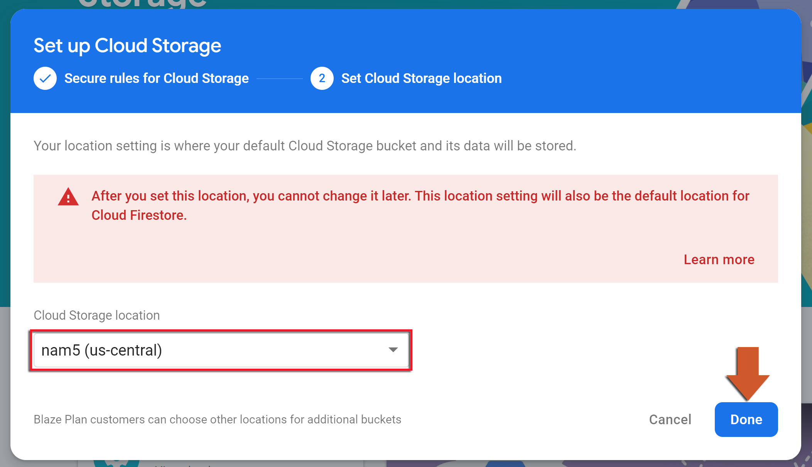

@title Cloud Storage Guides

<!-- Page HTML do not touch -->
<a />
[Back To Top](#top)

# Firebase Console

  Before using the Firebase Could Storage extension, you need to configure and enable your storage services in the [Firebase Console](https://console.firebase.google.com/). Follow the steps below to get started:

1. Go to **Storage** section and click on the **Get Started** button: 
      

2. You will get a pop-up (we will change the rules later), so click on the **Next** button: 
          

3. Select your **Cloud Storage location** and click on **Done** : 
          

4. Go to **Rules** section and change the rules condition to **`true`** (this just for testing purposes, and you will need to create your own rules before sending the app to production). Then click on **Publish** . 
          

5. You can now use Firebase Cloud Storage on iOS &amp; Android, and some features on Web.

  

---

<!-- Page HTML do not touch -->
<a />
[Back To Top](#top)

# Platform Setup

  Firebase Cloud Storage implementation uses SDK dependencies and therefore is only available on **Android** , **iOS** targets and **Web** with limited functionality. In this section we will cover the required setup necessary to start using the Firebase Cloud Storage extension on your game.
  Select your target platform below and follow the simple steps to get your project up and running:

> **:warning: IMPORTANT**
>
> Web target exports will have limited functionality.

* [Android Setup](Platform-Setup#Android_Setup) (once per project)
* [iOS Setup](Platform-Setup#iOS Setup) (once per project)
* [Web Setup](Platform-Setup#Web_Setup) (once per project)

  

---