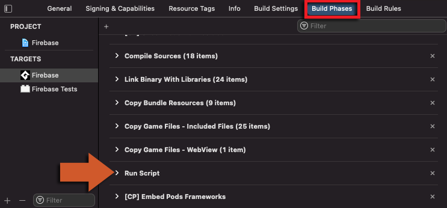
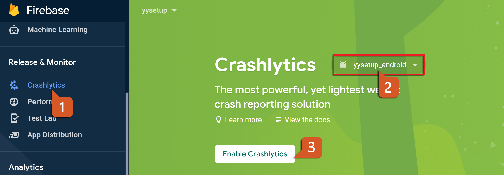

@title Crashlytics Guides

<!-- Page HTML do not touch -->
<a />
[Back To Top](#top)

# Building on iOS

Building your project on iOS requires some Xcode project changes:

1. Build your project from GMS2 first (using the iOS target) so it creates an Xcode project that we will edit in the steps below.
2. Before building your project further from Xcode, go to **Build Phases** and drag the **Run Script** item to the bottom: 
      

3. The result should look like this (with **Run Script** at the bottom of the list): 
      

4. You can now continue with the building process and the application will work as expected.

  

---

<!-- Page HTML do not touch -->
<a />
[Back To Top](#top)

# Crashlytics Setup

Firebase Crashlytics implementation uses SDK dependencies and therefore is only available on **Android** and **iOS** targets. In this section we will cover the steps necessary to start using the Firebase Crashlytics extension in your game.
Select your target platform below and follow the simple steps to get your project up and running (you only need follow this setup once per project):

* ${page.platform_setup#Android_Setup}
* ${page.platform_setup#iOS_Setup}

## Enabling Crashlytics

1. On your Firebase console, select **Crashlytics** under &quot;Release &amp; Monitor&quot;; then **select your Android** / **iOS** project **and click on Enable Crashlytics** . 
          

2. On this screen, the Firebase console will wait for a test crash from your app. To skip this screen you need to build a project (see [Building on iOS](#Building_on_iOS) if you are building for the iOS target), unplug your device and run a call to the included [FirebaseCrashlytics_Crash](crashlytics#FirebaseCrashlytics_Crash) function. 
      

3. You are now all set to monitor your game crash logs.

  

---