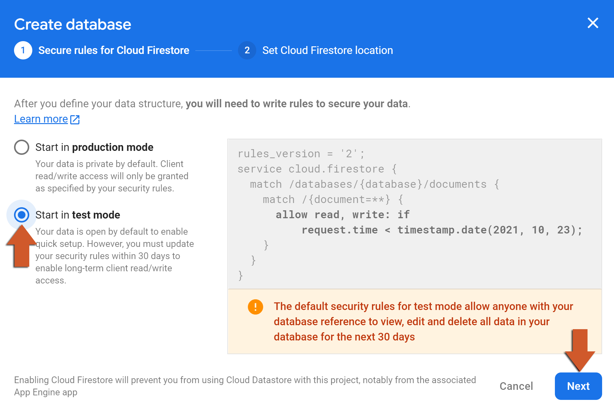
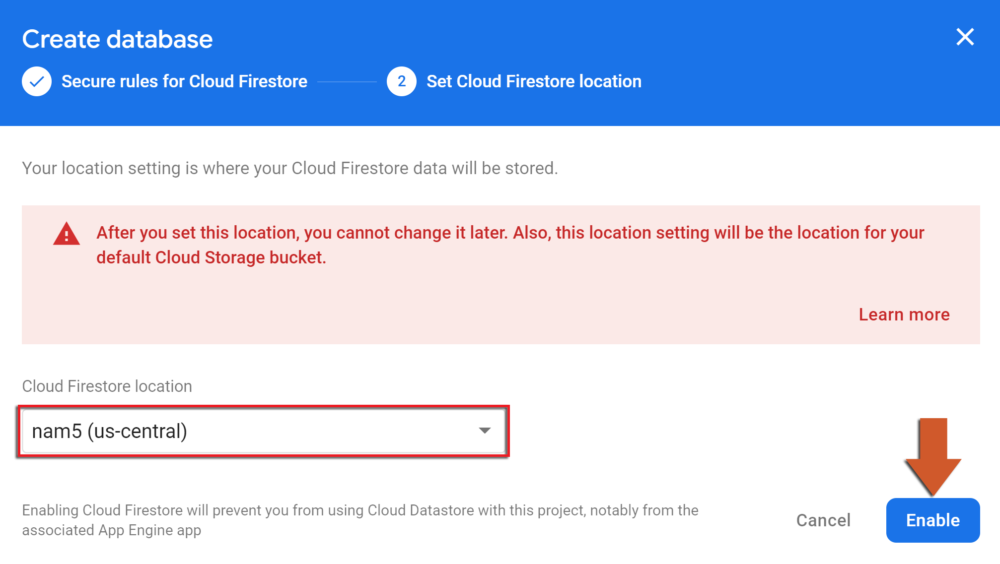

<!-- Page HTML do not touch -->
<a />
[Back To Top](#top)

# Firebase Console

  Before being able to use the Firebase Firestore extension we need to configure a new database to work with in the [Firebase Console](https://console.firebase.google.com/). Follow the steps below to get your first database set up.

1. On your Firebase project's dashboard, click on **Firestore Database** and then Create Database: 
        

2. Select **Start in**  **test mode**  **(otherwise you will need add your own rules for production mode) and click on Next** . 
      

3. Select your database server location and click on **Enable** . 
      

4. You are now ready to start using Firebase Firestore extension.

  

---

<!-- Page HTML do not touch -->
<a />
[Back To Top](#top)

# Platform Setup

  Firebase Firestore implementation uses both SDK (working on **Android** , **iOS** and **Web** ) and also REST API that allows it to work on any other platform. In this section we will cover the steps necessary to start using the Firebase Firestore extension in your game.
  Select your target platform below and follow the simple steps to get your project up and running:

* [Android Setup](Platform-Setup#Android_Setup) (once per project)
* [iOS Setup](Platform-Setup#iOS Setup) (once per project)
* [Web Setup](Platform-Setup#Web_Setup) (once per project)
* [REST API Setup](#REST_API_Setup)

## Advanced Configuration

  Firebase Firestore by default uses SDKs on **Android** , **iOS** and **Web** targets and uses REST API on all other exports, but you can change this behavior (i.e.: forcing REST API to be used even on SDK enabled platforms) by changing the extension options value inside extension window (2).
  

  

---

<!-- Page HTML do not touch -->
<a />
[Back To Top](#top)

# REST API Setup

  This setup is necessary for syncing the Firebase console with the REST API implementation of the extension.

1. On your Firebase console, click on the **Settings** icon (next to **Project Overview** ) and then on **Project settings** . 
        

2. Copy the **Project ID** . 
          

3. In your GameMaker project, open the **YYFirebaseFirestore** extension window using the asset browser. And fill in the **Project ID** information (1) also make sure you select the REST API mode (2) to make sure it works on all the available platforms. 
      

4. The extension should now work on all your REST API exports!
