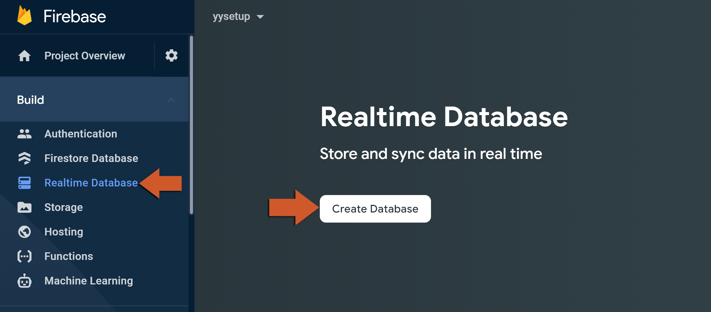
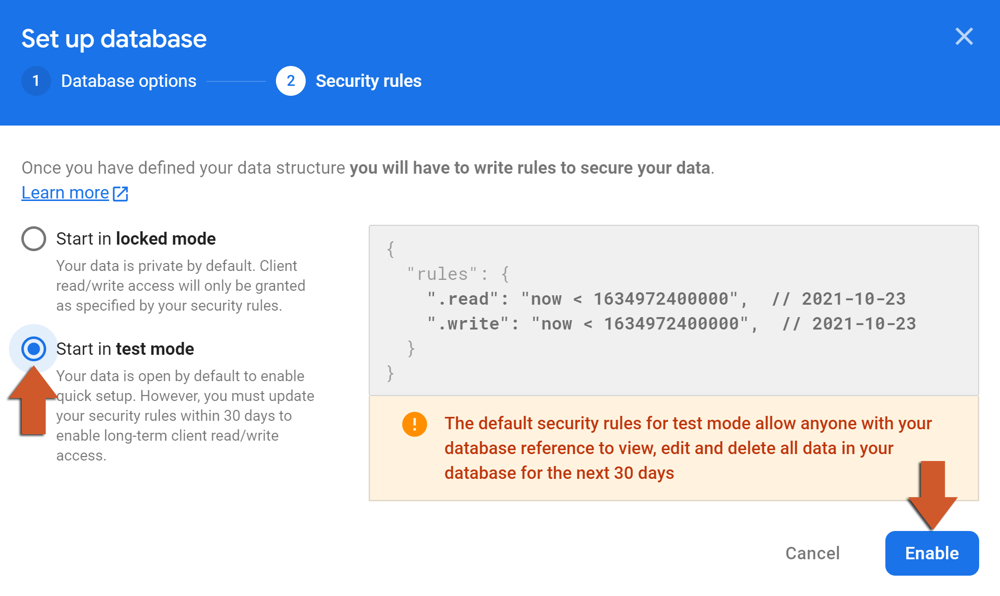

@title Realtime Database Guides

<!-- Page HTML do not touch -->
<a />
[Back To Top](#top)

# Firebase Console

  Before being able to use the Firebase Realtime Database extension we need to configure a new database to work with in the [Firebase Console](https://console.firebase.google.com/). Follow the steps below to get your first database set up.

1. On your Firebase project, click on **Realtime Database** and select **Create Database** . 
          

2. Select your database location and click on **Next** . 
      

3. Select **Start in**  **test mode**  **(otherwise you will need add your own rules for production mode) and click on Next** . 
      

4. You are now ready to start using Firebase Realtime Database extension.

  

---

<!-- Page HTML do not touch -->
<a />
[Back To Top](#top)

# Platform Setup

  Firebase Realtime Database implementation uses both SDK (working on **Android** , **iOS** and **Web**) and also REST API that allows it to work on any other platform. In this section we will cover the steps necessary to start using the Firebase Realtime Database extension on your game.
  Select your target platform below and follow the simple steps to get your project up and running:

* [Android Setup](Platform-Setup#Android_Setup) (once per project)
* [iOS Setup](Platform-Setup#iOS Setup) (once per project)
* [Web Setup](Platform-Setup#Web_Setup) (once per project)
* [REST API Setup](#REST_API_Setup)

## Advanced Configuration

   ** The Firebase Realtime Database extension by default uses SDKs on **Android** , **iOS** and **Web** targets and uses REST API on all other exports, but you can change this behavior (e.g.: forcing REST API to be used even on SDK enabled platforms) by changing the extension options value (2) in the extension window.
  

  

---

<!-- Page HTML do not touch -->
<a />
[Back To Top](#top)

# REST API Setup

  This setup is necessary for syncing the Firebase Realtime Database console with the REST API implementation. 

1. On your Firebase project's dashboard, click on **Realtime Database** and copy your database's link. 
        
 ** 
2. In your GameMaker project, open the script **YYFirebaseRealTime** and paste your link **in the Database URL** field (1) at the bottom of the window also change the config value to use the REST API (2). 
      

3. You now have the Firebase Realtime extension configured to use the REST API.

  

---

<!-- Page HTML do not touch -->
<a />
[Back To Top](#top)

# Server Side Rules

