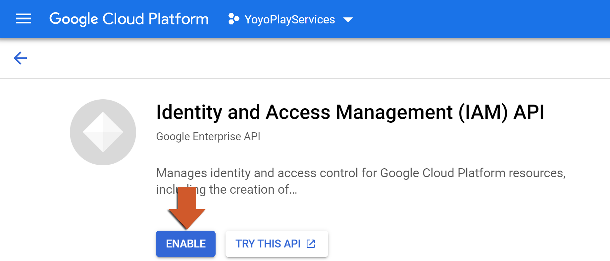
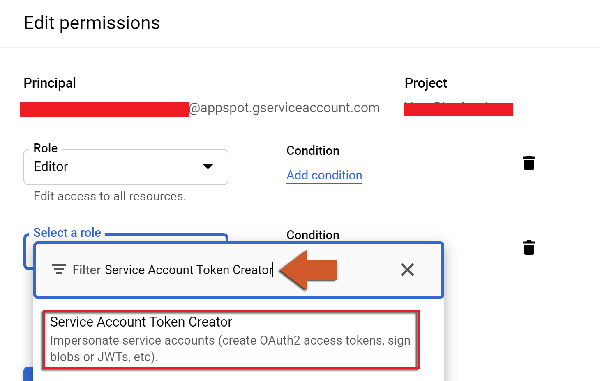
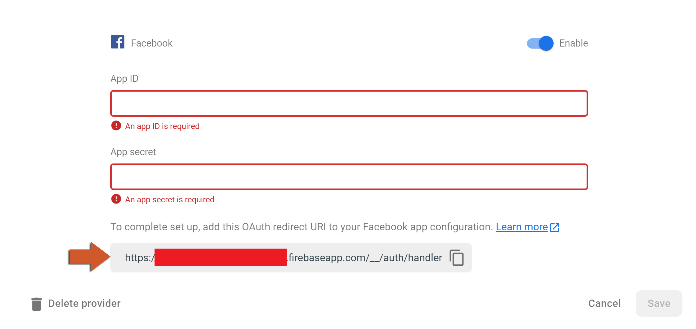

@title Logins and Authentication Guides

<a id="top"></a>
<!-- Page HTML do not touch -->
<a /><p align="right">[Back To Top](#top)</p>

# Apple Authentication

  This guide will get you up and running using Apple authentication.

## Prerequisites

  These are the requirements for this setup:

* **Apple SignIn** extension (download from the [marketplace](https://marketplace.gamemaker.io/assets/8598/apple-sign-in))

## Parameters

  You will need to obtain these parameters:

* **token:** Obtained from the callback of `AppleSignIn_CrossPlatform_AuthoriseUser` function (included in the Apple SignIn extension) ** 
* **provider:** `"apple.com"`
* **token_kind:** `"id_token"`
* **redirect_uri**  **: `"https://**.firebaseapp.com/__/auth/handler"`** , this value can be obtained from the [Firebase Console](https://console.firebase.google.com/) **→ Authentication → Sign-In Method → Sign-In Providers → Apple** 

## Functions

  The following functions are provided for signing-in / linking / re-authenticating the user:

* ${function.FirebaseAuthentication_SignIn_OAuth} (if the user is logged out)
* ${function.FirebaseAuthentication_LinkWithOAuthCredential} (if the user is logged in but has no provider)
* ${function.FirebaseAuthentication_ReauthenticateWithOAuth} (if the user is logged in and already linked to the Apple provider)


<br><br>

---

<!-- Page HTML do not touch -->
<a /><p align="right">[Back To Top](#top)</p>

# Custom Authentication

Custom Authentication gives to you the ability to sign in using any string as uid and is a really powerful feature, however it does mean that you will be responsible for creating your own unique ids (or using uids from other providers) and encoding/decoding your ids.

[[Warning: You are required to upgrade to the Blaze plan on Firebase to be able to use this feature.]]

## Prerequisites

  The following are the requirements for this setup:

1. Enable **Identity and Access Management (IAM) API** on the [Google Cloud](https://console.cloud.google.com/apis/library/iam.googleapis.com) console.<br>
      

2. Go to [IAM &amp; Admin](https://console.cloud.google.com/iam-admin/iam), search for a service named  `**@appspot.gserviceaccount.com` **(where `**` is your Firebase project's Project ID** ) and press the **Edit** icon.<br>
      

3. On the editor pop-up, click on the &quot; **ADD ANOTHER ROLE** &quot; button:<br>
      

4. Select the **Service Account Token Creator** role:<br>
      

5. This is how your services should look like now:<br>
      

6. Now you are allowed to create new custom accounts in the Firebase Authentication system, however you will need a server running for creating **tokens** (for this step we will use the **Firebase Cloud Functions** extension) with the following code:

```gml
exports.customSignUp = functions.https.onRequest((req, res) => 
{
    cors(req, res, () => 
    {
        //And decode here (your uid should be encoded on you GMS project and decoded here)
        let uid = req.body.uid;

        // Here are some official documentation links on how to create custom tokens
        // https://firebase.google.com/docs/auth/admin/create-custom-tokens
        // https://firebase.google.com/docs/reference/admin/node/admin.auth.Auth-1#createcustomtoken

        admin.auth().createCustomToken(uid).then((customToken) =>
        {
            res.status(200).send({"customToken":customToken});
            return true;
        })
        .catch((error) =>
        {
            res.status(400).send({"message":error});
            return false;
        });
    });
});
```
  Read how to create and deploy functions in the [Firebase Cloud Functions](https://marketplace.gamemaker.io/assets/10454/firebase-cloud-functions-ext) extension documentation.

## Parameters

  You will need to obtain the following parameters:

* **token:** Obtained from the callback using `http_request` to the `customSignUp` API method created above.

## Functions

  This is the function provided for signing in the user:

* ${function.FirebaseAuthentication_SignInWithCustomToken} (if the user is logged out)


<br><br>

---

<!-- Page HTML do not touch -->
<a /><p align="right">[Back To Top](#top)</p>

# Email Authentication

  This guide will get you up and running using Email authentication.

## Functions

  The following functions are provided for signing-in / linking / re-authenticating the user:

* ${function.FirebaseAuthentication_SignUp_Email} (if the user is not signed up)
* ${function.FirebaseAuthentication_SendEmailVerification}
* ${function.FirebaseAuthentication_SendPasswordResetEmail}
* ${function.FirebaseAuthentication_SignIn_Email} (if the user is logged out)
* ${function.FirebaseAuthentication_LinkWithEmailPassword} (if the user is logged in but has no provider)
* ${function.FirebaseAuthentication_ReauthenticateWithEmail} (if the user is logged in and already linked to the email provider)


<br><br>

---

<!-- Page HTML do not touch -->
<a /><p align="right">[Back To Top](#top)</p>

# Facebook Authentication

  This guide will get you up and running using Facebook authentication.

> **:information_source: INFO**
>
> The authentication works with both SDK and REST API versions.

## Prerequisites

  These are the requirements for this setup:

* [Facebook Extension](https://marketplace.gamemaker.io/assets/2011/facebook) (download from the [marketplace](https://marketplace.gamemaker.io/assets/2011/facebook))

## Parameters

  You will need to obtain these parameters:

* **token:** Obtained from the call to the `fb_asscesstoken` function (included in the Facebook Extension) ** 
* **provider:** `"facebook.com"`
* **token_kind:** `"access_token"`
* **redirect_uri**  **:** This value can be obtained from [Firebase Console](https://console.firebase.google.com/) **→ Authentication → Sign-In Method → Sign-In Providers → Facebook** (see the image below)<br>
      

## Functions

  The following functions are provided for signing-in / linking / re-authenticating the user:

* ${function.FirebaseAuthentication_SignIn_OAuth} (if the user is logged out)
* ${function.FirebaseAuthentication_LinkWithOAuthCredential} (if the user is logged in but has no provider)
* ${function.FirebaseAuthentication_ReauthenticateWithOAuth} (if the user is logged in and already linked to the phone provider)


<br><br>

---

<!-- Page HTML do not touch -->
<a /><p align="right">[Back To Top](#top)</p>

# GameCenter Authentication

  This guide will get you up and running using **GameCenter** authentication.

[[Warning: The SDK is required for this authentication meaning it will only work for iOS targets.]]

## Prerequisites

  These are the requirements for this setup:

* **GameCenter** extension (download from the [marketplace](https://marketplace.gamemaker.io/assets/10406/apple-gamecenter))
* Log in using the **`GameCenter_LocalPlayer_Authenticate`** function

## Functions

  The following functions are provided for signing-in / linking / re-authenticating the user:

* ${function.SDKFirebaseAuthentication_SignIn_GameCenter} (if the user is logged out)
* ${function.SDKFirebaseAuthentication_LinkWithGameCenter} (if the user is logged in but has no provider)
* ${function.SDKFirebaseAuthentication_ReauthenticateWithGameCenter} (if the user is logged in and already linked to the GameCenter provider)

  <br>


<br><br>

---

<!-- Page HTML do not touch -->
<a /><p align="right">[Back To Top](#top)</p>

# Google Authentication

  This guide will get you up and running using Google authentication.

## Prerequisites

  These are the requirements for this setup:

* The **Google SignIn** extension (download from the [marketplace](https://marketplace.gamemaker.io/assets/10457/google-signin-ext)).
* Get your **webClientID** , generated by **Google Sign-in** from the [Cloud Console](https://console.cloud.google.com/apis/credentials) (as shown on the image below)<br>
      

* In your project you need to call `GoogleSignIn_Show` with the project's **webClientID** .

## Parameters

  You will need to obtain these parameters:

* **token:** Obtained from the callback of the `GoogleSignIn_Show` function (included in the [Google SignIn](https://marketplace.gamemaker.io/assets/10457/google-signin-ext) extension) ** 
* **provider:** `"google.com"`
* **token_kind:** `"id_token"`
* **redirect_uri**  **:** `""`

## Functions

  The following functions are provided for signing-in / linking / re-authenticating the user:

* ${function.FirebaseAuthentication_SignIn_OAuth} (if the user is logged out)
* ${function.FirebaseAuthentication_LinkWithOAuthCredential} (if the user is logged in but has no provider)
* ${function.FirebaseAuthentication_ReauthenticateWithOAuth} (if the user is logged in and already linked to the phone provider)


<br><br>

---

<!-- Page HTML do not touch -->
<a /><p align="right">[Back To Top](#top)</p>

# <a name="Google_Play_Services_Authentication">Google Play Services Authentication

  This guide will get you up and running using Google Play Services authentication.

## Prerequisites

  These are the requirements for this setup:

* [Google Play Services](https://github.com/YoYoGames/GMEXT-GooglePlayServices) extension (download from the [marketplace](https://marketplace.gamemaker.io/assets/10099/google-play-services))
* Get your **webClientID** , generated by **Google Services** from the [Cloud Console](https://console.cloud.google.com/apis/credentials) (as shown on the image below)<br>
      

* Call the function `GooglePlayServices_RequestServerSideAccess` using the **webClientID** to get the authorization code from the google server.

## Parameters

  You will need to obtain these parameters:

* **token:** Obtained from the call to the `GooglePlayServices_RequestServerSideAccess` function (included in the Google Play Services extension, check documentation for more details) ** 
* **provider:** `"playgames.google.com"`
* **token_kind:** `"serverAuthCode"`
* **redirect_uri**  **:** `""`

## Functions

  The following functions are provided for signing-in / linking / re-authenticating the user:

* ${function.FirebaseAuthentication_SignIn_OAuth} (if the user is logged out)
* ${function.FirebaseAuthentication_LinkWithOAuthCredential} (if the user is logged in but has no provider)
* ${function.FirebaseAuthentication_ReauthenticateWithOAuth} (if the user is logged in and already linked to the phone provider)


<br><br>

---

<!-- Page HTML do not touch -->
<a /><p align="right">[Back To Top](#top)</p>

# Phone Authentication

  Phone authentication requires you to follow these 5 steps:

1. Get your **recaptchaSiteKey** from the ${function.FirebaseAuthentication_RecaptchaParams} function callback.
2. Solve the reCAPTCHA puzzle, for this you will need to host a website (demonstration included in Included Files).
3. The previous step will return you a **recaptchaToken** , which needs to be passed into your game (in the example we use **Firebase Real Time Database** extension to achieve this).
4. ** Send the verification code to the user, using the function ${function.FirebaseAuthentication_SendVerificationCode} and get the **sessionInfo** from the callback.
5. You should now have **SMS code** (request the user for it) and the **sessionInfo** .

## Functions

  The following functions are provided for signing-in / linking / re-authenticating the user:

* ${function.FirebaseAuthentication_SignInWithPhoneNumber} (if the user is logged out)
* ${function.FirebaseAuthentication_LinkWithPhoneNumber} (if the user is logged in but has no provider)
* ${function.FirebaseAuthentication_ReauthenticateWithPhoneNumber} (if the user is logged in and already linked to the phone provider)


<br><br>

---