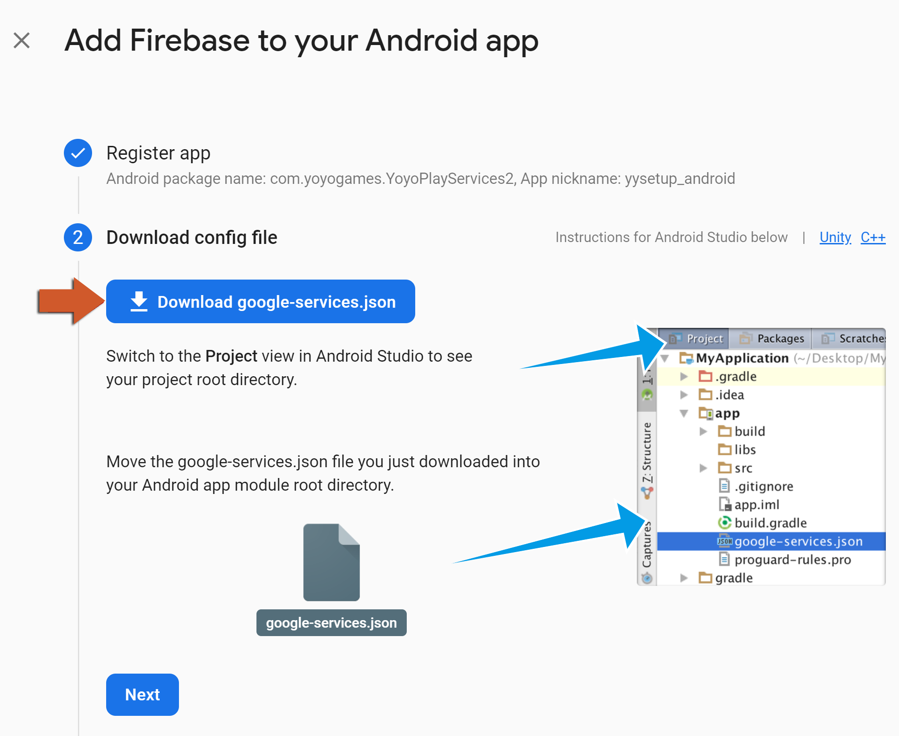
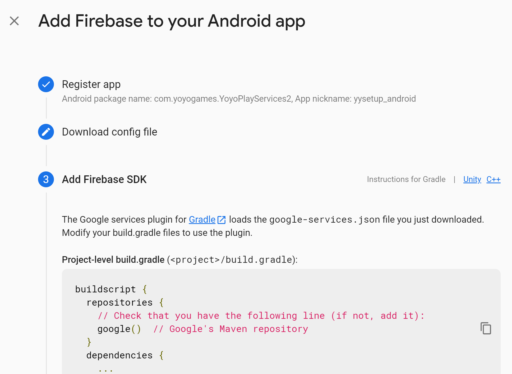
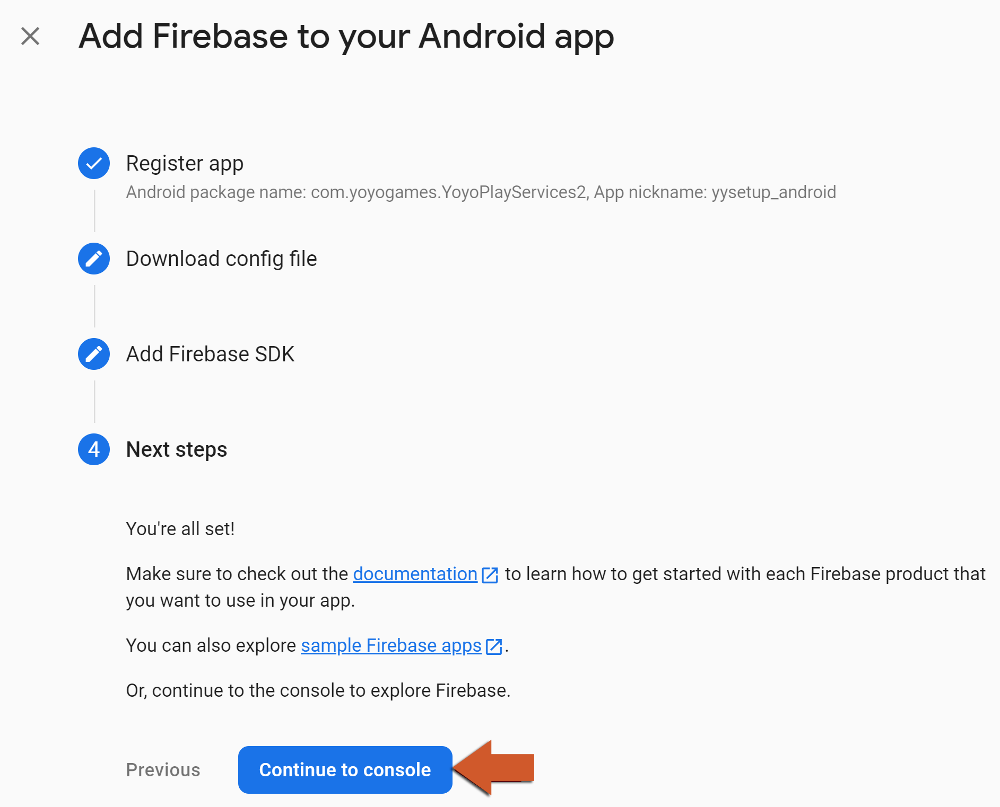
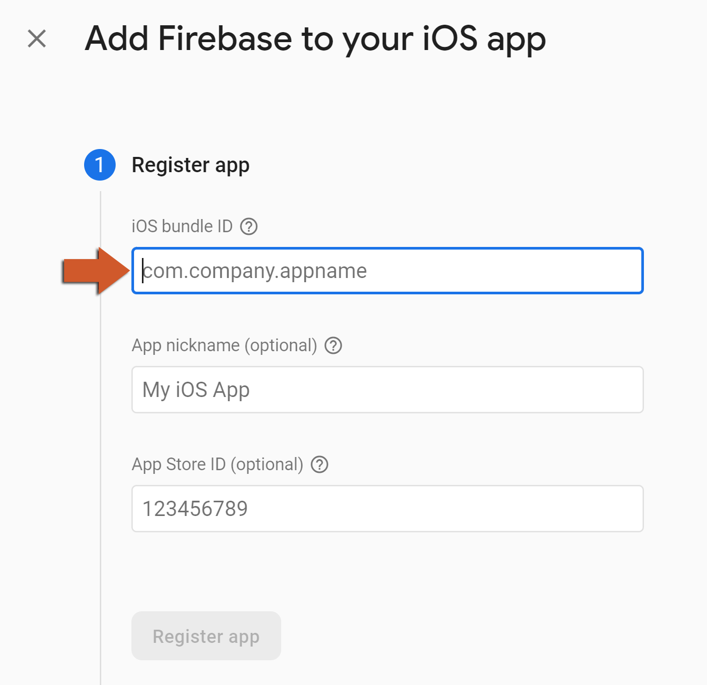
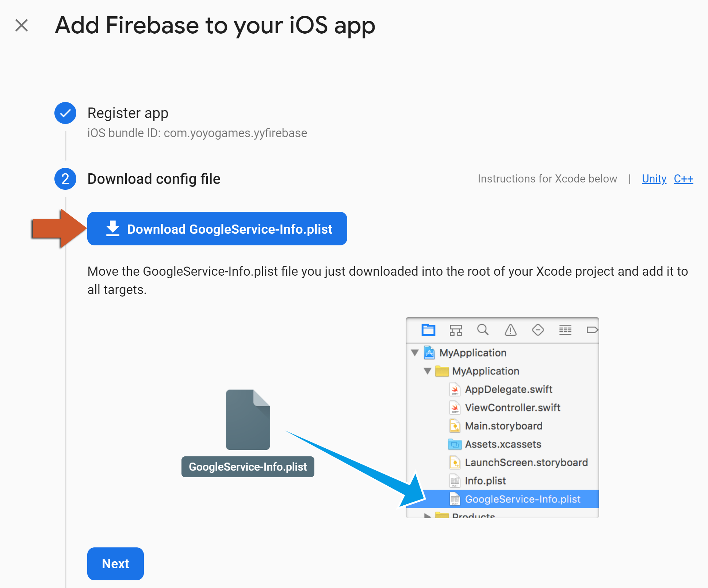
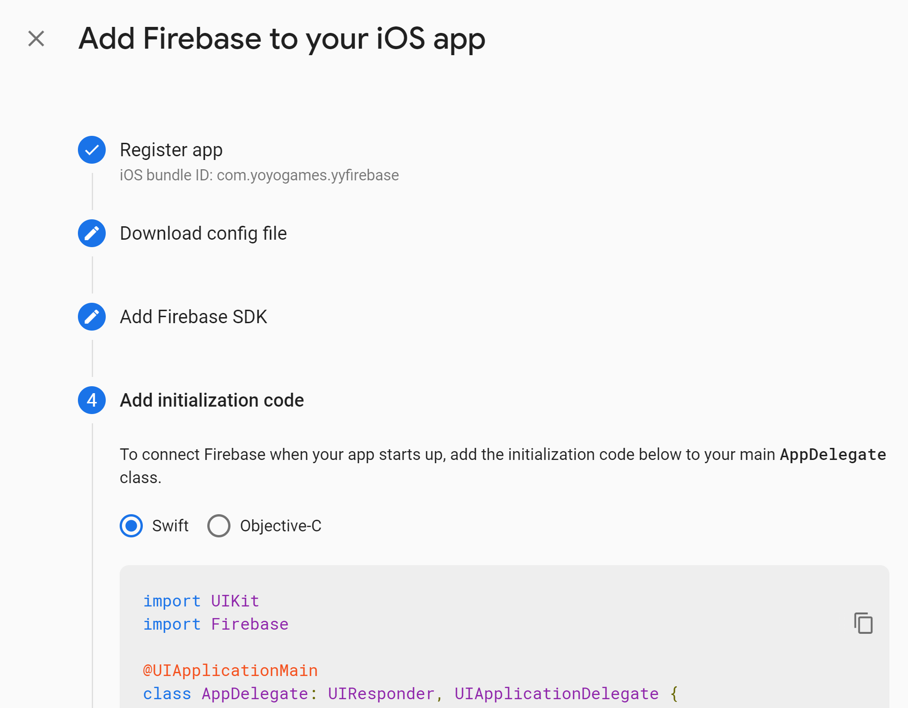
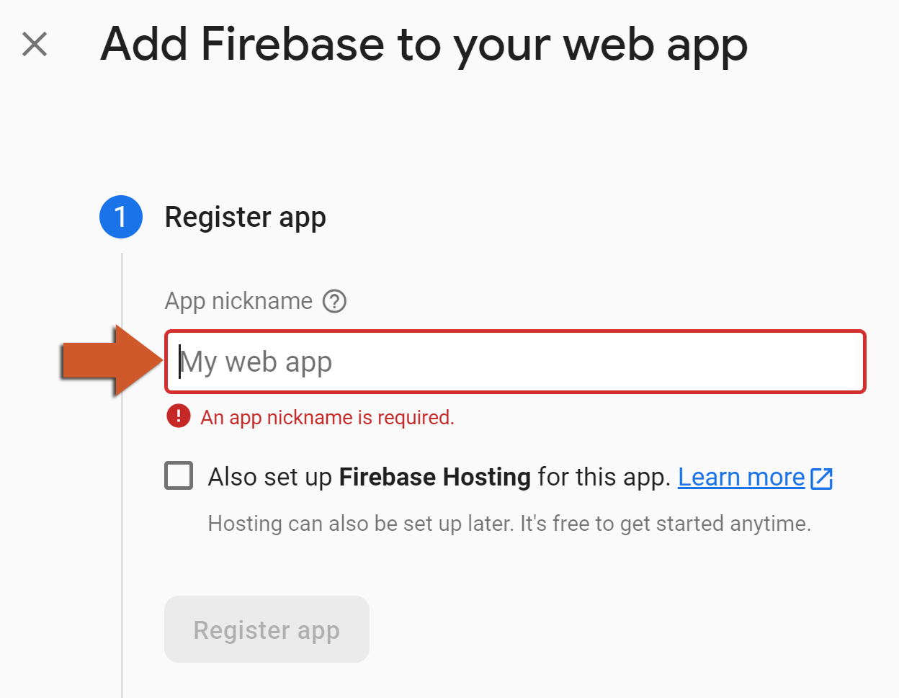
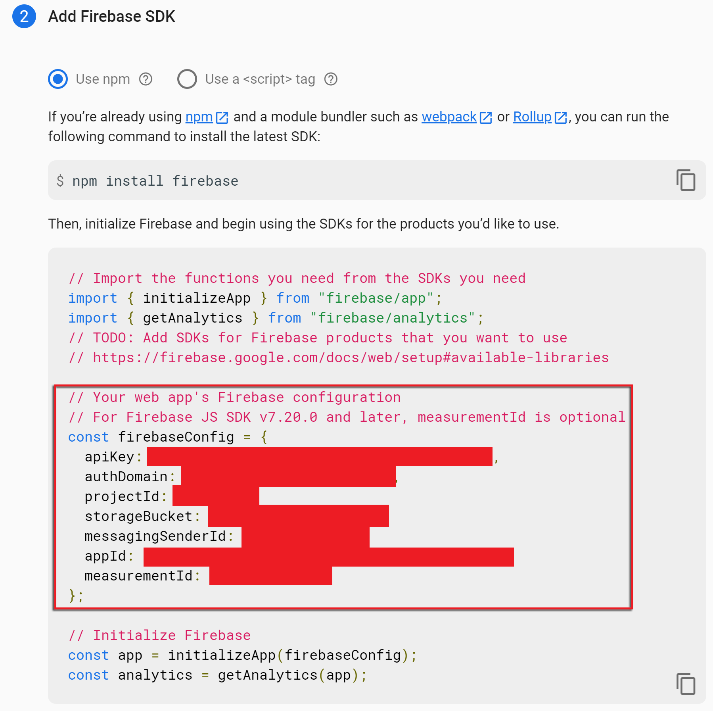

@title Platform Setup

<!-- Page HTML do not touch -->
<a />
[Back To Top](#top)

# Android Setup

This setup is necessary for all the Firebase modules using Android and needs to be done once per project, and basically involves importing the **google-services.json**  file into your project.

> **:warning: IMPORTANT**
>
> Please refer to [this Helpdesk article](https://help.gamemaker.io/hc/en-us/articles/115001368727-Setting-Up-For-Android) for instructions on setting up an Android project.

1. Click the **Settings** icon (next to Project Overview) and select **Project settings:**  
          

2. Now go to the **Your apps**  **section and click on the Android** button: 
      

3. On this screen you need enter your **Package name** (required), **App nickname** (optional) and Debug signing certificate SHA-1 (required if you are using Firebase Authentication). 
      
You can get your package name from the [Android Game Options](https://manual.gamemaker.io/monthly/en/#t=Settings%2FGame_Options%2FAndroid.htm), and your **Debug signing certificate SHA-1** from the [Android Preferences](https://manual.gamemaker.io/monthly/en/#t=Setting_Up_And_Version_Information%2FPlatform_Preferences%2FAndroid.htm) (under Keystore): 
      

4. Click on ** **Download google-services.json**  (make sure to save this file as we will need it in subsequent steps). 
      

5. Ignore this screen, as this is already done in the extension. 
      

6. Click on the **Continue to console** button. 
      

7. Now go into GameMaker, double click the extension **FirebaseSetup** asset. 
      

8. In the extension panel just fill in the paths for the correct files (Android and/or iOS). 
      

> **:warning: IMPORTANT**
>
> To ensure safety, refrain from storing credential files within your project directory. Instead, place them in a distinct folder to prevent accidental sharing of files in public repositories. During compilation, these files will be automatically incorporated into your project folder.

9. You have now finished the main setup for all Firebase Android modules! 

  

---

<!-- Page HTML do not touch -->
<a />
[Back To Top](#top)

# iOS Setup

  This setup is necessary for all the Firebase modules using iOS and needs to be done once per project, and basically involves importing the ** **GoogleServices-Info.plist**  file into your project.

> **:warning: IMPORTANT**
>
> Please refer to [this Helpdesk article](https://help.gamemaker.io/hc/en-us/articles/115001368747-Setting-Up-For-iOS-Including-iPadOS) for instructions on setting up an iOS project.

1. Click the **Settings** icon (next to Project Overview) and select **Project settings:**  
        

2. Now go to the **Your apps**  **section and click on the iOS** button: 
      

3. Fill the form with your **iOS Bundle ID** , **App nickname** and **AppStore ID** (last two are optional). 
      

4. Click on ** **Download GoogleService-info.plist**  (make sure to save this file as we will need it in subsequent steps). 
      

5. Ignore this screen, as this is already done in the extension. 
      

6. Ignore this screen as well, as this is also done in the extension. 
      

7. Click on the **Continue to console** button: 
      

8. Now go into GameMaker, double click the extension **FirebaseSetup** asset. 
      

9. In the extension panel just fill in the paths for the correct files (Android and/or iOS). 
      

> **:warning: IMPORTANT**
>
> To ensure safety, refrain from storing credential files within your project directory. Instead, place them in a distinct folder to prevent accidental sharing of files in public repositories. During compilation, these files will be automatically incorporated into your project folder.

10. Make sure to set up [CocoaPods](https://help.gamemaker.io/hc/en-us/articles/360008958858-iOS-and-tvOS-Using-CocoaPods) for your project *unless* you are only using the REST API in an extension (if one is provided -- not all extensions provide a REST API) or the Firebase Cloud Functions extension (which only uses a REST API).
11. You have now finished the main setup for all Firebase iOS modules!

  

---

<!-- Page HTML do not touch -->
<a />
[Back To Top](#top)

# Web Setup

  This setup is necessary for all the Firebase modules using Web export and needs to be done once per project, and basically involves adding Firebase libraries and your Firebase values to the **index.html**  file in your project.

1. Click the **Settings** icon (next to Project Overview) and then **Project settings:**  
      

2. Now go to the **Your apps**  **section and click on the Web** (``) button: 
      

3. Enter your App nickname (required):

4. On this screen, just copy the **firebaseConfig** struct: 
      

5. Paste the struct's contents in a text editor, replace all double quotes `"` with single quotes `'` and copy the resulting text. Also make sure to add single quotes `'` to the struct keys.

6. Paste the result in the **Firebase Config Struct** extension option. Note that this cannot contain any double quotes `"`.